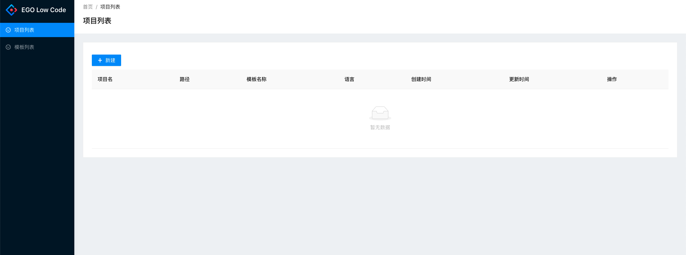
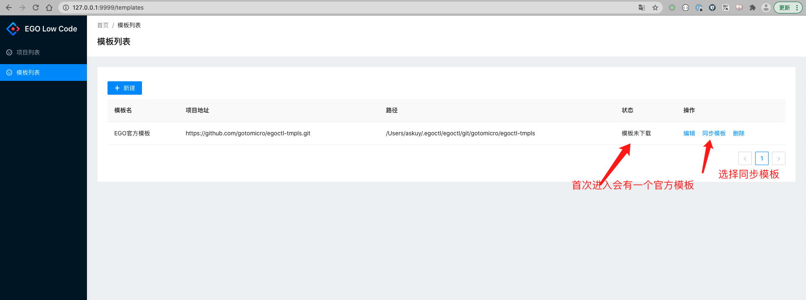
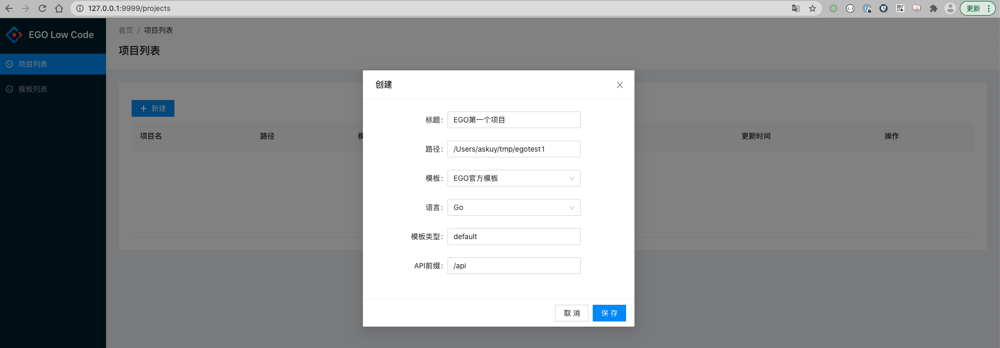
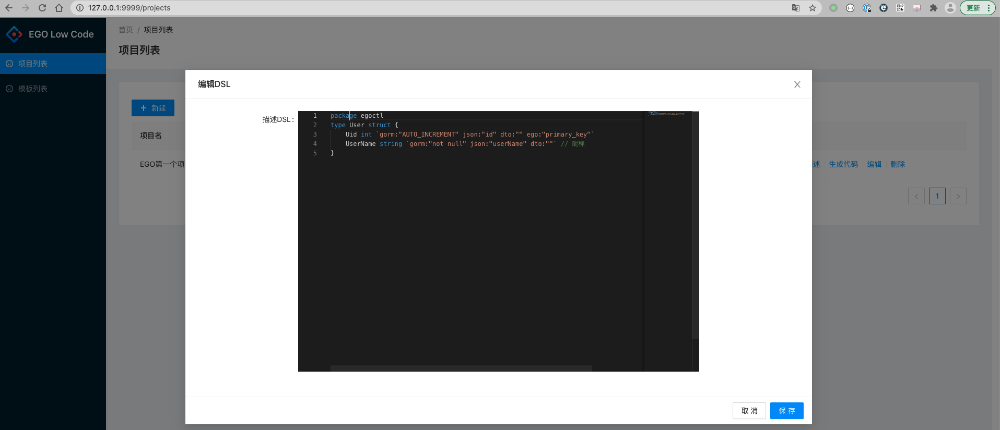

# egoctl
## 1 Requirements
- Go version >= 1.16.

## 2 Installation
go get github.com/gotomicro/ego


## 3 快速生成代码
* 启动web: egoctl web start
* 访问http://127.0.0.1:9999
* 如下所示



* 我们第一次进入页面，先配置生成代码的模板，你也可以自己自定义自己的模板



* 然后在进入项目页面，创建项目



* 编写DSL



* 创建项目的go mod
```bash
mkdir /Users/askuy/tmp/egotest1 
cd /Users/askuy/tmp/egotest1 && go mod init egotest1
```
* 点击生成代码
* 运行你的代码
```bash
cd /Users/askuy/tmp/egotest1
go mod tidy
vim config/local.toml 更改db配置
export EGO_DEBUG=true && go run main.go
```

## 4 DSL配置
```
package egoctl
type User struct {
	Uid int `gorm:"AUTO_INCREMENT" json:"id" dto:"" ego:"primary_key"`                      // id
    UserName string `gorm:"not null" json:"userName" dto:""` // 昵称
}
```


## 5 模板配置
### 5.1 根据模型设置模板
DSL配置
```
package egoctl
type User struct {
	Uid int `gorm:"AUTO_INCREMENT" json:"id" dto:"" ego:"primary_key"`                      // id
    UserName string `gorm:"not null" json:"userName" dto:""` // 昵称
}
```
### 5.2 获取主键 
模版配置
```
{{modelSchemas|fieldsGetPrimaryKey|snakeString}}
```

### 5.3 生成结构体
模板配置
```
type {{modelName|upperFirst}} struct {
	
	{{value.FieldName}} {{value.FieldType}} `gorm:"{{value|fieldGetTag:"gorm"}}"` {{value.Comment}}
	
}
```

### 5.4 判断某字段是否存在
模板配置
```


```

## 6 根据单个字段设置模板
DSL配置
```
type User struct {
	Uid int `gorm:"AUTO_INCREMENT" json:"id" dto:"" ego:"primary_key"`                      // id
    UserName string `gorm:"not null" json:"userName" dto:""` // 昵称
}
```

### 6.1 获取某个字段的驼峰（常用于JSON，前后端对接）
```
{{value.FieldName|camelString|lowerFirst}}
UserName  变成   userName
```

### 6.2 获取某个字段的蛇形（常用于数据库）
```
{{value.FieldName|snakeString|lowerFirst}}
UserName  变成   user_name
```
